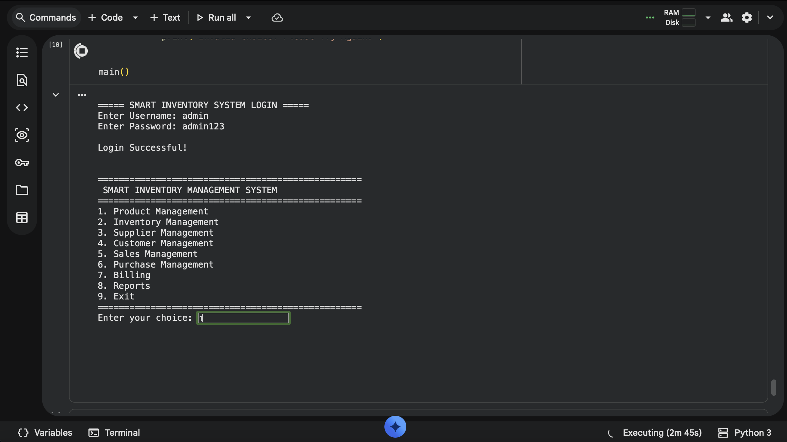
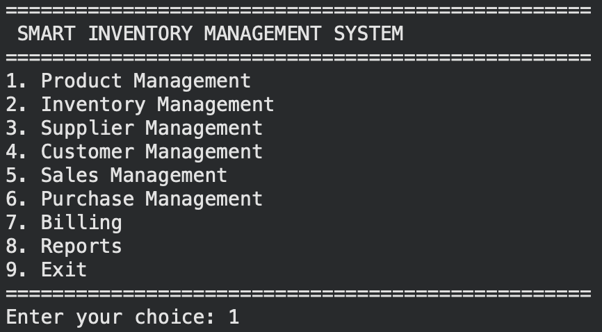
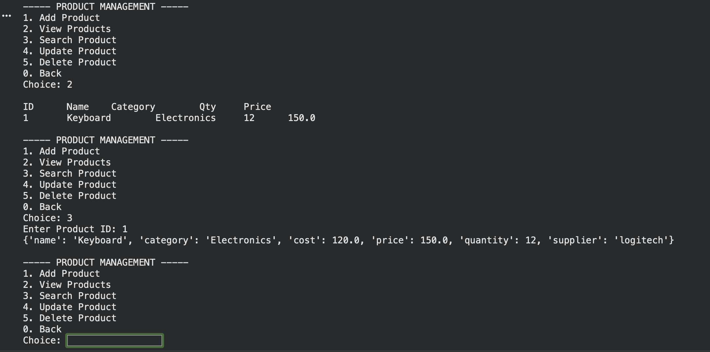
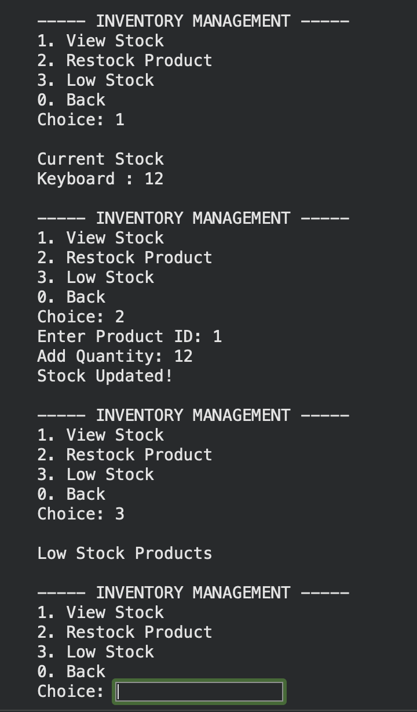
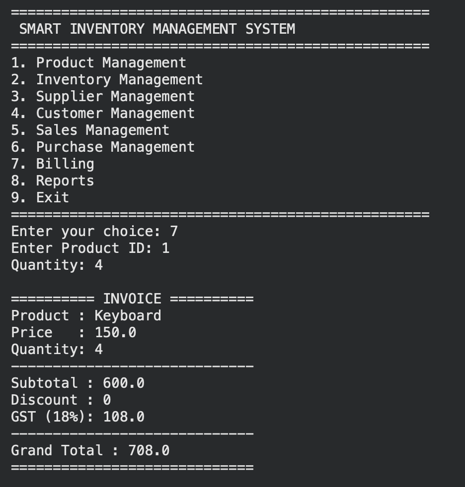
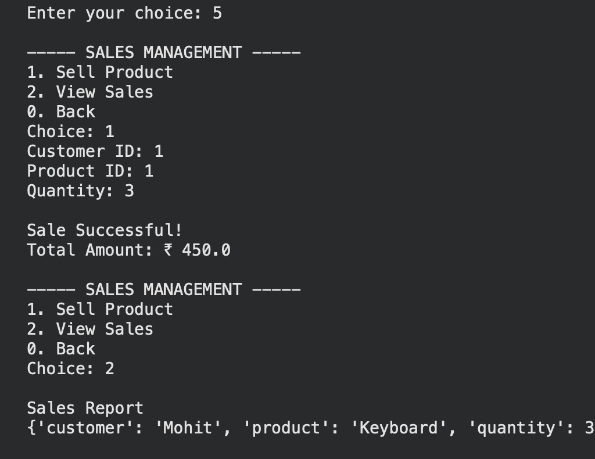
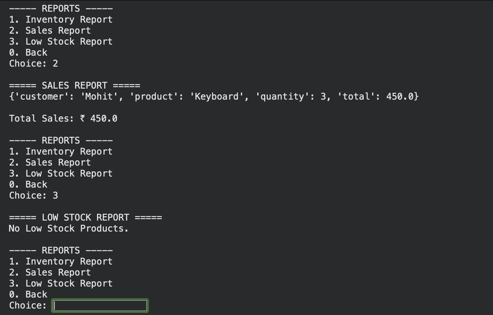
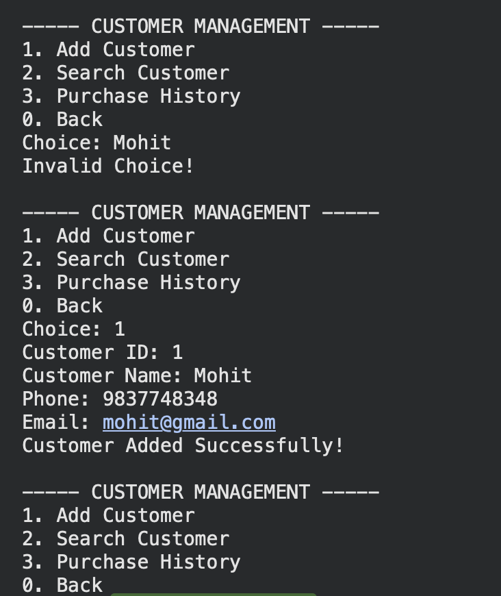

# 📦 Smart Inventory Management System

A **Smart Inventory Management System** built in **Python** using **Object-Oriented Programming (OOP)** principles. This project was developed as a **mini project during the IIT Jammu Summer School** to apply Python programming concepts in solving a real-world inventory management problem.

The application provides a menu-driven console interface with modules for authentication, product management, inventory management, supplier management, customer management, sales, purchase, billing, and reporting.

---

## 🚀 Features

- 🔐 Secure User Authentication
- 📦 Product Management
- 📊 Inventory Management
- 🚚 Supplier Management
- 👥 Customer Management
- 💰 Sales Management
- 🛒 Purchase Management
- 🧾 Billing System
- 📈 Reports
- 🖥️ Menu-Driven Console Interface

---

## 🛠️ Technologies Used

- Python
- Object-Oriented Programming (OOP)
- Google Colab

---

## 📂 Project Structure

```
Smart Inventory Management System/
│
├── smart_inventory_management.ipynb
├── README.md
├── LICENSE
├── .gitignore
└── screenshots/
```

---

## 📸 Screenshots

### Login Screen



### Main Menu



### Product Management



### Inventory Management



### Billing & Reports






---

## 🎯 Learning Outcomes

Through this project, I gained practical experience in:

- Python Programming
- Object-Oriented Programming (OOP)
- Menu-Driven Application Development
- Modular Programming
- Inventory Management System Design
- Problem Solving and Logical Thinking

## 👨‍💻 Author

**Mohit Maddirala**

Developed as a mini project during the **IIT Jammu Summer School**.

---

⭐ If you found this project interesting, consider giving it a **Star** on GitHub!
